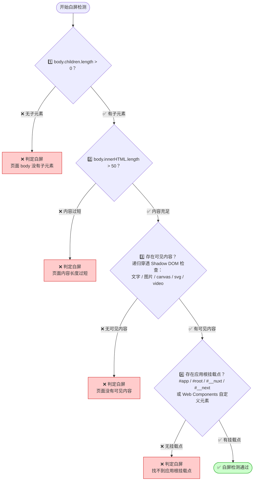
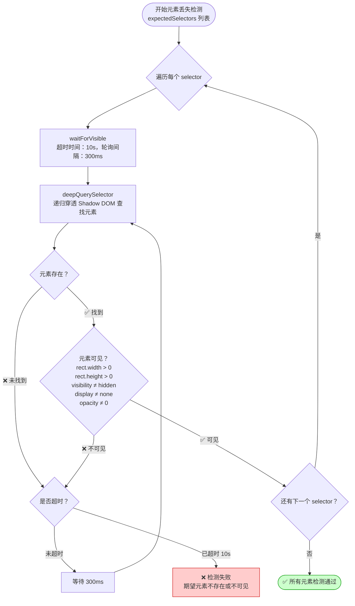
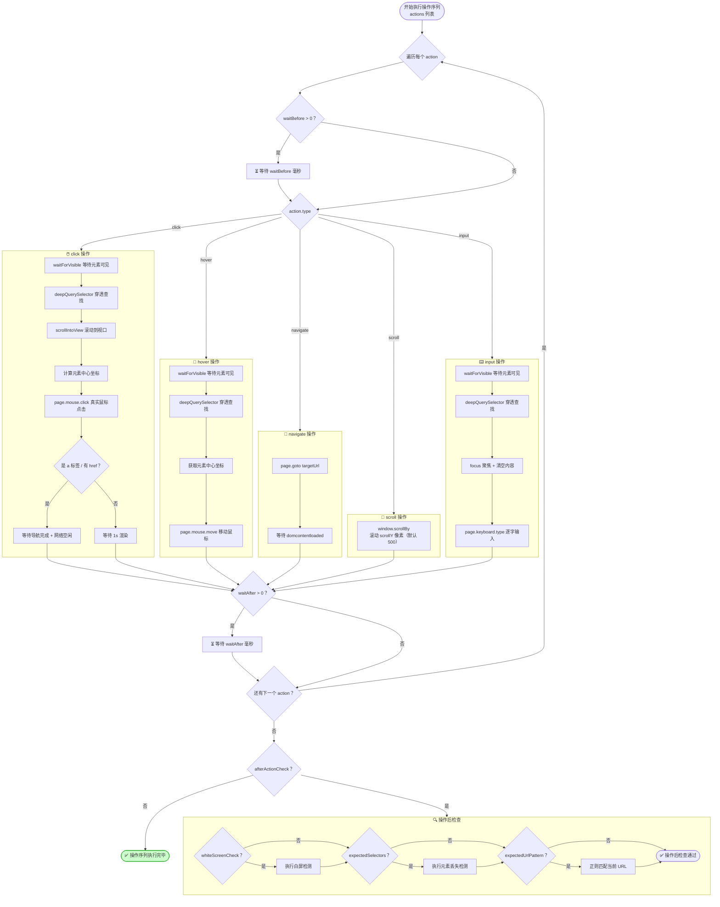

# TDesign E2E 测试

基于 **Puppeteer + Jest** 的 TDesign 端到端测试框架，通过配置化方式实现 **白屏检测** 和 **元素丢失检测**，防止页面发布后出现白屏或关键元素缺失等问题。

## ✨ 核心能力

| 能力           | 说明                                                             |
| -------------- | ---------------------------------------------------------------- |
| 🔲 白屏检测     | 检查页面 body 子元素数量、innerHTML 长度、可见内容、SPA 根挂载点 |
| 🧩 元素丢失检测 | 通过 CSS 选择器验证关键元素是否存在且可见                        |
| 🖱️ 点击跳转     | 模拟用户点击，跳转后继续检测目标页面                             |
| 🎯 悬浮操作     | 模拟 hover 行为，验证下拉菜单、提示等浮层元素                    |
| 🔀 路由导航     | 直接访问 SPA 路由地址，验证页面渲染                              |
| 📜 页面滚动     | 模拟滚动操作，验证懒加载、虚拟列表等场景                         |
| ⌨️ 文本输入     | 模拟用户输入，验证搜索、表单等交互场景                           |

## 📁 项目结构

```
tdesign-e2e/
├── jest.config.ts                 # Jest 测试配置
├── tsconfig.json                  # TypeScript 配置
├── package.json                   # 依赖与脚本
└── tests/
    ├── tdesign.spec.ts            # 测试入口（自动根据配置生成用例）
    ├── config/
    │   ├── types.ts               # 类型定义（PageConfig / PageAction 等）
    │   ├── pages.config.ts        # 📌 配置汇总入口（合并所有模块）
    │   └── modules/               # 📂 按模块拆分的配置目录
    │       ├── index.ts           # 模块统一导出
    │       ├── home.ts            # TDesign 官网首页
    │       ├── uniapp.ts          # UniApp 相关页面
    │       ├── miniprogram.ts     # 小程序相关页面
    │       ├── vue-next.ts        # Vue Next（桌面端 Vue3）
    │       └── mobile-vue.ts      # Mobile Vue（移动端）
    └── utils/
        └── helpers.ts             # 检测工具函数（白屏检测、元素检测等）
```

## 🚀 快速开始

### 1. 安装依赖

```bash
npm install
```

> 首次安装时，Puppeteer 会自动下载 Chromium 浏览器。如果网络受限，可设置环境变量：
> ```bash
> PUPPETEER_DOWNLOAD_BASE_URL=https://cdn.npmmirror.com/binaries/chrome-for-testing npm install
> ```

### 2. 运行测试

```bash
# 运行所有测试
npm test

# 详细输出
npm run test:verbose

# 调试模式（配合 Chrome DevTools）
npm run test:debug
```

## 📝 配置说明

测试配置按模块拆分，位于 `tests/config/modules/` 目录下，由 `pages.config.ts` 统一汇总。框架会自动为每条配置生成一个独立的测试用例。

### 模块化配置

配置按 TDesign 子站/框架拆分为独立模块：

| 模块文件                 | 对应站点                | 说明                       |
| ------------------------ | ----------------------- | -------------------------- |
| `modules/home.ts`        | TDesign 官网首页        | 首页白屏检测、导航菜单交互 |
| `modules/uniapp.ts`      | UniApp                  | UniApp 概览页、组件跳转    |
| `modules/miniprogram.ts` | 小程序                  | 小程序概览页、组件跳转     |
| `modules/vue-next.ts`    | Vue Next（桌面端 Vue3） | 组件页面、路由导航         |
| `modules/mobile-vue.ts`  | Mobile Vue（移动端）    | 移动端概览页、组件页面     |

### 新增模块

以新增 React 模块为例，只需 3 步：

**第 1 步**：在 `tests/config/modules/` 下创建 `react.ts`

```typescript
import { type PageConfig } from '../types';

const reactPages: PageConfig[] = [
  {
    name: 'React - Button 组件',
    url: 'https://tdesign.tencent.com/react/components/button',
    whiteScreenCheck: true,
    expectedSelectors: ['td-doc-layout', '.TDesign-doc-demo'],
  },
];

export default reactPages;
```

**第 2 步**：在 `modules/index.ts` 中导出

```typescript
export { default as reactPages } from './react';
```

**第 3 步**：在 `pages.config.ts` 中导入并合并

```typescript
import { reactPages } from './modules';

const config: PageConfig[] = [
  ...homePages,
  ...uniappPages,
  ...miniprogramPages,
  ...vueNextPages,
  ...mobileVuePages,
  ...reactPages,  // 新增
];
```

### 基础配置字段

```typescript
interface PageConfig {
  name: string;              // 测试用例名称
  url: string;               // 页面 URL
  whiteScreenCheck?: boolean; // 是否进行白屏检测（默认 true）
  expectedSelectors?: string[]; // 期望存在的元素选择器列表
  actions?: PageAction[];    // 页面加载后执行的操作序列
  afterActionCheck?: AfterActionCheck; // 操作执行后的检查
  waitAfterLoad?: number;    // 页面加载后额外等待时间（毫秒）
  viewport?: { width: number; height: number }; // 自定义视口大小
  skip?: boolean;            // 是否跳过该用例
}
```

### 操作类型

```typescript
interface PageAction {
  type: 'click' | 'hover' | 'navigate' | 'scroll' | 'input';
  selector?: string;    // 目标元素选择器（click/hover/input 时必填）
  targetUrl?: string;   // 跳转 URL（navigate 时必填）
  inputValue?: string;  // 输入内容（input 时必填）
  scrollY?: number;     // 滚动像素量（scroll 时使用，默认 500）
  description?: string; // 操作描述
  waitBefore?: number;  // 操作前等待（毫秒）
  waitAfter?: number;   // 操作后等待（毫秒）
}
```

## 📋 配置示例

### 1️⃣ 基础白屏 + 元素检测

最简单的用法：访问页面，检测是否白屏，验证关键元素存在。

```typescript
{
  name: 'TDesign 官网首页',
  url: 'https://tdesign.tencent.com/',
  whiteScreenCheck: true,
  expectedSelectors: [
    'header',  // 顶部导航
    'main',    // 主内容区
    'footer',  // 底部
  ],
}
```

### 2️⃣ 点击跳转

先访问入口页面，点击某个链接跳转，再对目标页面进行检测。

```typescript
{
  name: '从首页点击跳转到组件页',
  url: 'https://tdesign.tencent.com/',
  whiteScreenCheck: true,
  actions: [
    {
      type: 'click',
      selector: 'a[href*="components"]',
      description: '点击组件链接',
    },
  ],
  afterActionCheck: {
    expectedSelectors: ['.TDesign-doc-demo', '.TDesign-doc-sidebar'],
    whiteScreenCheck: true,
  },
}
```

### 3️⃣ SPA 路由导航

直接通过 URL 跳转到指定路由页面。

```typescript
{
  name: '路由导航测试',
  url: 'https://tdesign.tencent.com/vue-next/components/button',
  whiteScreenCheck: true,
  actions: [
    {
      type: 'navigate',
      targetUrl: 'https://tdesign.tencent.com/vue-next/components/input',
      description: '路由跳转到 Input 组件',
    },
  ],
  afterActionCheck: {
    expectedSelectors: ['.TDesign-doc-demo'],
    whiteScreenCheck: true,
  },
}
```

### 4️⃣ 悬浮操作

验证 hover 触发的浮层、下拉菜单等。

```typescript
{
  name: '悬浮展开菜单测试',
  url: 'https://tdesign.tencent.com/',
  whiteScreenCheck: true,
  actions: [
    {
      type: 'hover',
      selector: '.header-nav-item',
      description: '悬浮展开导航菜单',
    },
  ],
  afterActionCheck: {
    expectedSelectors: ['.header-nav-item'],
    whiteScreenCheck: true,
  },
}
```

### 5️⃣ 组合操作（滚动 + 输入）

```typescript
{
  name: '搜索功能测试',
  url: 'https://tdesign.tencent.com/',
  whiteScreenCheck: true,
  actions: [
    {
      type: 'scroll',
      scrollY: 300,
      description: '向下滚动 300px',
      waitAfter: 500,
    },
    {
      type: 'click',
      selector: '.search-btn',
      description: '点击搜索按钮',
    },
    {
      type: 'input',
      selector: '.search-input',
      inputValue: 'Button',
      description: '输入搜索关键词',
      waitAfter: 1000,
    },
  ],
  afterActionCheck: {
    expectedSelectors: ['.search-result'],
    whiteScreenCheck: true,
  },
}
```

### 6️⃣ 跳过某个用例

```typescript
{
  name: '暂时跳过的页面',
  url: 'https://example.com/wip',
  skip: true,
}
```

## 🔍 核心检测流程

### 白屏检测流程

白屏检测通过 4 层递进策略判断页面是否正常渲染，任一层检测失败即判定为白屏：



### 元素丢失检测流程

元素检测支持 Shadow DOM 穿透查找，通过轮询等待机制确保元素可见：



### 执行操作序列流程

操作序列按配置顺序逐一执行，支持 5 种操作类型和时序控制：



## ⚙️ 进阶配置

### 自定义视口大小

用于测试不同分辨率下的页面：

```typescript
{
  name: '移动端适配测试',
  url: 'https://tdesign.tencent.com/mobile-vue/',
  viewport: { width: 375, height: 812 },
  whiteScreenCheck: true,
}
```

### 操作后 URL 校验

通过正则表达式验证跳转后的 URL：

```typescript
afterActionCheck: {
  whiteScreenCheck: true,
  expectedUrlPattern: '/vue-next/components/input',
}
```

### 添加等待时间

对于加载较慢的页面，可以设置额外等待：

```typescript
{
  name: '慢加载页面',
  url: 'https://example.com/heavy-page',
  waitAfterLoad: 3000,  // 页面加载后额外等待 3 秒
  actions: [
    {
      type: 'click',
      selector: '.lazy-btn',
      waitBefore: 1000,  // 点击前等待 1 秒
      waitAfter: 2000,   // 点击后等待 2 秒
    },
  ],
}
```

## 🛠️ 技术栈

- **[Puppeteer](https://pptr.dev/)** — 无头浏览器控制
- **[Jest](https://jestjs.io/)** — 测试运行器 & 断言库
- **[ts-jest](https://kulshekhar.github.io/ts-jest/)** — TypeScript 支持
- **TypeScript** — 类型安全的配置

## 📄 License

MIT
